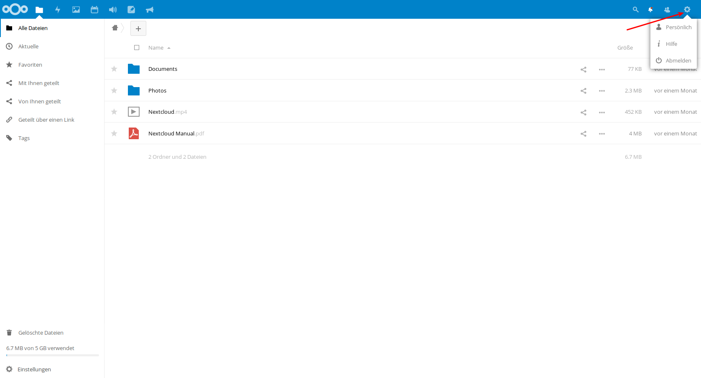

Synchronisieren mit dem eigenen Rechner zu Hause
====================================================

Desktop-Client
^^^^^^^^^^^^^^^

Wie für die herkömmlichen Cloudlösungen auch, existiert auch für Nextcloud ein Programm, mit dem Sie die Cloud auf Ihrem Rechner wie einen normalen Ordner in ihr System integrieren können.
Nach der ersten Anmeldung an der Cloud im Browser erscheint ein Pop-up-Fenster, das Ihnen das Herunterladen eines Clients für ihr Betriebsystem anbietet. Haben Sie das Fenster zugemacht und wollen nun aber erneut die Links zu dem Download der Clients sehen, klicken Sie auf der Startseite von Owncloud auf ihren Namen (oben rechts) und wählen Sie den Bereich „Persönlich".

.. image:: /bilder/cloud/2.png

Hier können Sie ihren persönlichen Cloud-Account konfigurieren und zum Beispiel ein  Benutzerfoto hochladen. Wenn Sie etwas nach unten scrollen, werden Sie drei Schaltflächen sehen, die sie zum Download der Desktop-Clients führen.

.. image:: /bilder/cloud/3.png

Hier können Sie die Version des Clients wählen und im Anschluss herunterladen, die ihrem Betriebssystem entspricht. Blau hinterlegt ist der Button für das Betriebsystem, das Sie im Moment verwenden. Die Installation gestaltet sich recht einfach. Sie müssen nach der Installation nur die URL der Cloud eintragen https://owncloud.copernicus-gymnasium.de/owncloud und ihre Zugangsdaten angeben.

.. important:: Bitte beachten Sie: Wenn Sie das Passwort ihres Zugangs einmal ändern, müssen Sie das neue Passwort im Nextcloud-Programm auf ihrem Rechner natürlich auch entsprechend neu angeben.

Der Inhalt ihres Cloudverzeichnisses auf dem Cloudserver in der Schule wird nach erfolgreichem Verbindungsaufbau direkt auf ihrem Rechner eingebunden.

.. _app-sk:

Mobile Geräte (Android, iOS etc.)
^^^^^^^^^^^^^^^^^^^^^^^^^^^^^^^^^^^

Auch für mobile Geräte gibt es Programme, mit denen Sie auf den Inhalt ihres Cloudverzeichnisses zugreifen können. Sie finden diese im Appstore ihres mobilen Gerätes. Der Nextlcoud-Client für Android kostet allerdings so circa einen Euro. Ein kleiner Preis verglichen mit den Vorteilen, die Nextcloud bietet. Das Geld geht an die Entwickler des Projekts. Die Einrichtung eines mobilen Clients geschieht analog zu dem der Desktop-Variante.

Aufgaben
^^^^^^^^^

1. Wenn Sie ihr privates Laptop dabei haben, dann können Sie versuchen, den Desktop-Client zu installieren.

2. Wenn nicht, dann betrachten Sie dies als Hausaufgabe :-)
